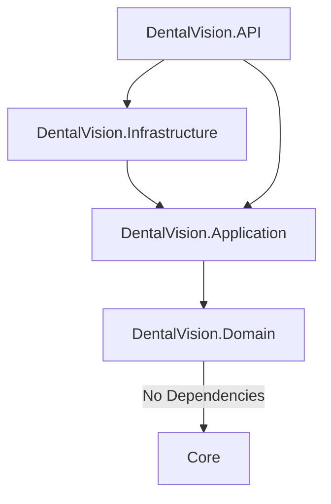
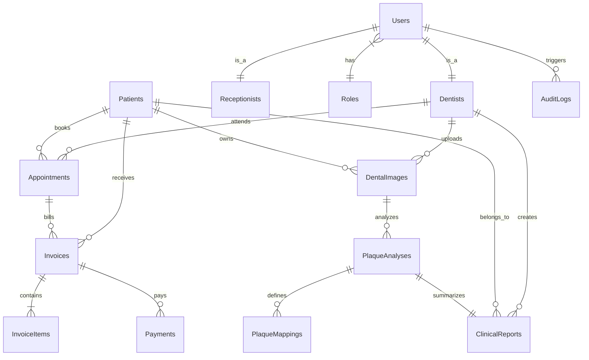
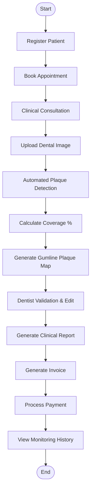
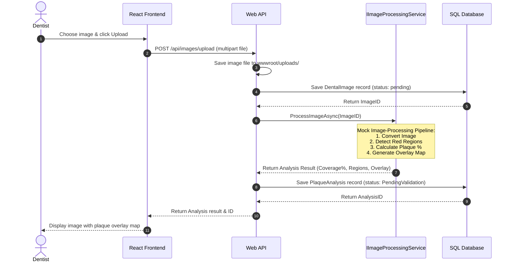
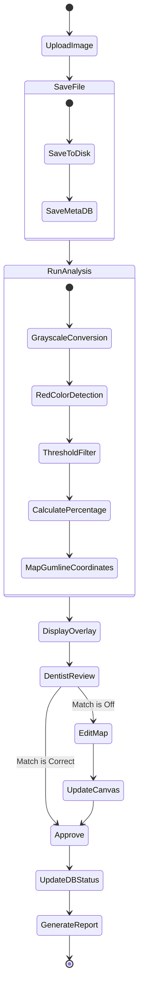

# DentalVision: Complete Software Architecture & Requirements Specification

This document details the system design, requirements, and technical specification for **DentalVision**, a Web-Based Dental Clinic Management System with Automated Gumline Plaque Mapping.

---

## 1. Software Architecture

### Layered Architecture (Clean Architecture)
The backend is structured using Microsoft's recommended Clean Architecture pattern. This decouples the core domain logic from infrastructure details and external presentation layers.



- **Domain Layer**: Contains enterprise business rules, entities, value objects, and repository interfaces. It has zero external dependencies.
- **Application Layer**: Contains application business logic, CQRS commands/queries, services, DTOs, FluentValidation rules, and the `IImageProcessingService` abstraction.
- **Infrastructure Layer**: Implements repository interfaces, EF Core DbContext, JWT token generation, logging, and the mock `ImageProcessingService`.
- **API Layer**: Exposes RESTful HTTP endpoints, handles Authentication/Authorization middlewares, and acts as the entry point.

### Frontend Architecture (React + Vite)
The React application follows a feature-based folder structure, using Axios for REST API requests, React Router for client-side routing, React Hook Form for inputs, and Chart.js for data visualization.

```
src/
├── assets/          # Static assets (images, logos)
├── components/      # Global shared components (Navbar, Sidebar, Button)
├── layouts/         # Layout components (AdminLayout, AppLayout)
├── pages/           # Page-level components
├── hooks/           # Custom React hooks (useAuth, useFetch)
├── services/        # API service modules (api.js, authService.js)
├── contexts/        # React context providers (AuthContext, ThemeContext)
├── routes/          # Navigation and route definitions
├── utils/           # Helper functions and formatters
├── styles/          # Styling files (index.css)
└── features/        # Feature-specific modules
    ├── dashboard/   # Dashboards for Admin, Dentist, Receptionist
    ├── patients/    # Patient listing, profiles, history
    ├── appointments/# Scheduling calendar and booking
    ├── billing/     # Invoices, items, payment entries
    ├── reports/     # Clinical reports and PDF outputs
    └── analysis/    # Image upload, plaque detection, gumline mapping
```

### Key Architectural Flows

#### Authentication & Authorization Flow
1. User requests login using email and password via `POST /api/auth/login`.
2. Backend verifies credentials, checks user activation, generates a JWT access token (containing userId, name, and role claims), and a secure HttpOnly refresh token.
3. React client stores the JWT access token in memory (or secure local storage) and roles inside `AuthContext`.
4. Subsequent API calls include the JWT in the `Authorization: Bearer <token>` header.
5. Role-based Access Control (RBAC) is enforced on endpoints via the `[Authorize(Roles = "Administrator,Dentist")]` attribute.

#### Plaque Upload & Analysis Flow
1. Dentist uploads patient's dental image with plaque-disclosing dye applied via `POST /api/images/upload`.
2. The image is saved locally in `wwwroot/uploads/` on the server, and a database entry is created in the `DentalImages` table.
3. The image ID is passed to `IImageProcessingService.ProcessImageAsync(imageId)`.
4. The simulated image processing service processes the pixel data, runs color-threshold detection (detecting reddish-purple areas representing stained plaque), computes the percentage coverage, identifies coordinates for gumline mapping, and generates a heatmap overlay.
5. A `PlaqueAnalysis` record is created with status `PendingValidation`.
6. The Dentist reviews the overlay on the UI, adjusts the detected boundaries on a canvas if necessary, and submits approvals via `POST /api/analysis/{id}/validate`.

---

## 2. Feature Breakdown by Role

### Administrator
- **User Management**: Create, read, update, delete (CRUD) receptionists, dentists, and administrator accounts. Assign roles and update credentials.
- **Clinic Configurations**: Manage clinic name, contact information, working hours, and operational configurations.
- **Audit Logs**: View comprehensive trace logs of all user actions (e.g., patient registrations, payment updates, login failures).
- **System Dashboard**: View high-level metrics of active patients, revenue trends, and operational plaque statistics.

### Dentist
- **Patient Viewer**: View patient lists, search profile details, and access historic clinical reports.
- **Appointment Planner**: View assigned appointments in daily/weekly calendars.
- **Image & Plaque Tool**: Upload oral photos, trigger automated plaque mapping, review coverage percentages, modify maps via visual editor, and finalize validations.
- **Clinical Reporting**: Automatically compile dental analysis, patient files, and recommendation comments into clinical PDF reports.

### Receptionist
- **Patient Registration**: Search, register, and update patient demographical records.
- **Scheduling**: Book, reschedule, cancel, or mark appointments as completed.
- **Billing & Payments**: Generate invoices, add service items, record payment receipts (Cash, Card, Insurance), and monitor invoice balances.

---

## 3. Functional Requirements Specification

| ID | Requirement | Input | Process | Output |
|---|---|---|---|---|
| **FR-01** | User Authentication | Email, Password | Authenticate credentials, hash match, generate JWT + Refresh tokens. | JWT token, user profile, role. |
| **FR-02** | Register Patient | Name, DOB, Phone, Email, Address, History | Validate inputs, save to SQL database. | Unique Patient ID, profile saved. |
| **FR-03** | Schedule Appointment | Patient ID, Dentist ID, Date, Time, Reason | Check dentist availability, log appointment. | Scheduled appointment slot. |
| **FR-04** | Upload Dental Image | Image file (PNG/JPG), Patient ID | Save file to storage, log metadata in database. | Uploaded Image ID. |
| **FR-05** | Automated Plaque Analysis | Dental Image ID | Parse pixel color distribution (red-stained dye), calculate coverage. | Plaque percentage, overlay heatmap, mapped nodes. |
| **FR-06** | Dentist Plaque Validation | Plaque Analysis ID, Adjusted coordinates, Notes | Modify plaque coverage map, update analysis status to `Approved`. | Updated plaque percentage, approved status. |
| **FR-07** | Generate Clinical Report | Patient ID, Analysis ID, Dentist Recommendations | Compile patient details, plaque stats, charts, and dentist remarks. | PDF Clinical Report. |
| **FR-08** | Create Invoice | Patient ID, Appointment ID, Service list | Aggregate service rates, apply taxes/discounts. | Pending invoice with unique ID. |
| **FR-09** | Record Payment | Invoice ID, Amount, Payment Method | Deduct paid amount from invoice balance, mark status. | Payment receipt, updated balance status. |
| **FR-10** | Clinical Monitoring | Patient ID | Query historical plaque percentages over time. | Line chart data depicting plaque trends. |

---

## 4. Non-Functional Requirements Specification

- **Performance**: Automated plaque image analysis must complete in less than 2.0 seconds. Page transition and dashboard loads must respond within 800ms.
- **Security**: Data transmission must use TLS 1.3 (HTTPS). Passwords must be hashed using BCrypt. Direct SQL injection must be blocked using EF Core parameterization. Strict CORS rules must be enforced.
- **Scalability**: Clean Architecture structure enables horizontal scaling. Image assets can be offloaded to Cloud Storage (AWS S3 / Azure Blob) in the future without disrupting Domain services.
- **Availability**: System target availability is 99.9% uptime.
- **Maintainability**: Clear separation of concern rules allows replacing mock services with OpenCV or Python models via the `IImageProcessingService` interface.
- **Usability**: Responsive layouts suitable for tablets and desktop monitors. Large, clickable target zones for dental clinics. Color theme follows AAA contrast standards.
- **Auditability**: All transactional updates (payments, data deletes, credentials modifications) must write to an immutable `AuditLogs` table.

---

## 5. Database Design & ERD

### Database Tables (SQL Server)
- **Users**: Admin, Dentist, and Receptionist system login data.
- **Roles**: System access roles.
- **Patients**: Demographics and historical records of clinical visits.
- **Dentists**: Dentist specialization, license numbers, and user links.
- **Receptionists**: Receptionist profile details.
- **Appointments**: Consultation bookings.
- **Invoices**: Header tables containing patient links and totals.
- **InvoiceItems**: Line-level breakdown of treatment prices.
- **Payments**: Invoice settlement logs.
- **DentalImages**: Original image uploads.
- **PlaqueAnalyses**: Plaque coverage statistics and validation metadata.
- **PlaqueMappings**: Cartesian nodes representing coordinates of detected plaque on teeth.
- **ClinicalReports**: Summarized clinical assessments and recommendations.
- **AuditLogs**: Trace logs for security audit purposes.
- **Notifications**: Internal alerts for dentists and receptionists.
- **ClinicSettings**: Global key-value configurations.

### Database ERD (Mermaid)



---

## 6. Data Dictionary

### Table: Users
| Field | Datatype | Length | Nullable | Description |
|---|---|---|---|---|
| UserID | INT (PK) | - | No | Unique identity. |
| Email | NVARCHAR | 256 | No | Login email (unique). |
| PasswordHash | NVARCHAR | 512 | No | Hashed user password. |
| FirstName | NVARCHAR | 100 | No | First name. |
| LastName | NVARCHAR | 100 | No | Last name. |
| RoleID | INT (FK) | - | No | Links to Roles table. |
| IsActive | BIT | - | No | Status of user access. |
| CreatedAt | DATETIME | - | No | Timestamp of creation. |

### Table: Patients
| Field | Datatype | Length | Nullable | Description |
|---|---|---|---|---|
| PatientID | INT (PK) | - | No | Unique identity. |
| FirstName | NVARCHAR | 100 | No | First name. |
| LastName | NVARCHAR | 100 | No | Last name. |
| DateOfBirth | DATE | - | No | Date of birth. |
| Gender | NVARCHAR | 20 | Yes | Gender. |
| Phone | NVARCHAR | 50 | No | Contact phone. |
| Email | NVARCHAR | 256 | Yes | Contact email. |
| Address | NVARCHAR | 500 | Yes | Residential address. |
| MedicalHistory | NVARCHAR | MAX | Yes | Health history and notes. |
| CreatedAt | DATETIME | - | No | Registration date. |

### Table: PlaqueAnalyses
| Field | Datatype | Length | Nullable | Description |
|---|---|---|---|---|
| AnalysisID | INT (PK) | - | No | Unique identity. |
| ImageID | INT (FK) | - | No | Links to DentalImages table. |
| CoveragePercentage | DECIMAL | (5,2) | No | Plaque coverage ratio (0-100). |
| ConfidenceScore | DECIMAL | (3,2) | No | AI model certainty (0-1). |
| Status | NVARCHAR | 50 | No | PendingValidation, Approved, Edited. |
| DetectedRegions | NVARCHAR | MAX | Yes | JSON array of coordinates. |
| CreatedAt | DATETIME | - | No | Processing timestamp. |
| ApprovedByDentistID | INT (FK) | - | Yes | ID of Dentist who validated. |
| ApprovedAt | DATETIME | - | Yes | Verification timestamp. |

---

## 7. Main Process Flow



---

## 8. Use Case Diagram

```mermaid
left_to_right_direction
actor Administrator
actor Dentist
actor Receptionist

rectangle DentalVision {
    usecase UC_Login "Login & Auth"
    usecase UC_ManageUsers "Manage Users"
    usecase UC_RegPatient "Register Patient"
    usecase UC_Schedule "Schedule Appointments"
    usecase UC_Billing "Manage Invoices & Payments"
    usecase UC_Upload "Upload Dental Images"
    usecase UC_Analyze "Run Plaque Mapping"
    usecase UC_Validate "Validate Plaque Results"
    usecase UC_Report "Generate Clinical Reports"
    usecase UC_Settings "Clinic Settings"
    usecase UC_Audit "View Audit Logs"
}

Administrator --> UC_Login
Administrator --> UC_ManageUsers
Administrator --> UC_Settings
Administrator --> UC_Audit

Dentist --> UC_Login
Dentist --> UC_Upload
Dentist --> UC_Analyze
Dentist --> UC_Validate
Dentist --> UC_Report

Receptionist --> UC_Login
Receptionist --> UC_RegPatient
Receptionist --> UC_Schedule
Receptionist --> UC_Billing
Receptionist --> UC_Upload
```

---

## 9. Sequence Diagrams

### Image Upload and Plaque Analysis Sequence


---

## 10. Activity Diagrams

### Plaque Detection & Dentist Validation Activity


---

## 11. REST API Design

### Authentication
- `POST /api/auth/login`
  - **Request**: `{ "email": "user@dental.com", "password": "Password123" }`
  - **Response (200)**: `{ "token": "JWT_STRING", "user": { "id": 1, "firstName": "John", "lastName": "Doe", "role": "Dentist" } }`
  - **Validation**: Email validation, password length constraints.
- `POST /api/auth/register` (Admin only)
  - **Request**: `{ "firstName": "Jane", "lastName": "Smith", "email": "jane@dental.com", "password": "Password123", "roleId": 2 }`
  - **Response (201)**: `{ "id": 2, "email": "jane@dental.com" }`

### Patients
- `GET /api/patients?search=doe` (Dentist/Receptionist)
  - **Response (200)**: Array of Patient DTOs.
- `POST /api/patients` (Receptionist)
  - **Request**: Patient creation DTO.
  - **Response (201)**: Created Patient object.

### Appointments
- `GET /api/appointments?date=2026-07-09` (Dentist/Receptionist)
  - **Response (200)**: List of appointments with details.
- `POST /api/appointments` (Receptionist)
  - **Request**: `{ "patientId": 1, "dentistId": 1, "appointmentDate": "2026-07-10T10:00:00", "reason": "Routine Cleaning" }`
  - **Response (201)**: Created appointment details.

### Plaque Analysis
- `POST /api/images/upload` (Dentist/Receptionist)
  - **Request**: Form data with key `file` (Image) and `patientId`.
  - **Response (201)**: `{ "imageId": 1, "fileName": "img1.png", "patientId": 1 }`
- `GET /api/analysis/{imageId}` (Dentist)
  - **Response (200)**: Plaque analysis result (coverage, mock gumline map coordinates).
- `POST /api/analysis/{analysisId}/validate` (Dentist)
  - **Request**: `{ "approvedPercentage": 32.5, "approvedRegions": "[[x1,y1],[x2,y2]]", "dentistNotes": "Adjusted lower incisor coverage" }`
  - **Response (200)**: Success message, updated validation status.

### Billing
- `POST /api/billing/invoices` (Receptionist)
  - **Request**: `{ "patientId": 1, "appointmentId": 1, "items": [{ "description": "Teeth Cleaning", "unitPrice": 80.00, "quantity": 1 }] }`
  - **Response (201)**: Created invoice.
- `POST /api/billing/payments` (Receptionist)
  - **Request**: `{ "invoiceId": 1, "amount": 80.00, "paymentMethod": "Card" }`
  - **Response (200)**: Payment processed successfully, updated invoice status.

---

## 12. UI Pages & Design Guide
The styling system uses a premium medical palette:
- **Primary Color**: `#2563EB` (Deep Royal Blue) - Used for primary actions, sidebar background, headers.
- **Secondary Color**: `#14B8A6` (Modern Teal) - Used for buttons, stats counters, highlighting.
- **Accent Color**: `#22C55E` (Emerald Green) - Used for approved states, correct thresholds, positive balances.
- **Danger Color**: `#EF4444` (Vivid Red) - Used for plaque highlight mappings, unpaid invoices, alerts.
- **Background**: `#F8FAFC` (Soft Ice White) - Used for content page backgrounds.

### Layout Wireframe Design
- **Sidebar**: Sticky left panel. Standard logo at top. Profile card at bottom. Navigation items change dynamically based on role.
- **Header**: Displays current date/time, notification hub dropdown, logout button.
- **Main Canvas Panel**: Rounded container blocks (`border-radius: 12px`) with subtle, premium shadows (`box-shadow: 0 4px 6px -1px rgb(0 0 0 / 0.1)`).

---

## 13. Mock Plaque Processing Pipeline
```
[Dental Image Source]
       │
       ▼
[Save Local Image (wwwroot/uploads)]
       │
       ▼
[Image processing Simulation (IImageProcessingService)]
 ├── Color Extraction: Scans image pixels
 ├── Red-Spectrum Threshold Filtering
 ├── Plaque Overlay Grid Generation
 └── Gumline Vector Mapping
       │
       ▼
[Return Response]
 ├── CoveragePercentage (Calculated as Red Pixels / Tooth Pixels * 100)
 ├── DetectedRegions (JSON containing structural grid points)
 ├── OverlayImage (Path to output image with highlighted red plaque borders)
 └── ConfidenceScore (Random float between 0.85 and 0.98 for mock output)
```

The interface structure:
```csharp
public interface IImageProcessingService
{
    Task<PlaqueAnalysisResultDto> AnalyzeDentalImageAsync(string imagePath, int imageId);
}
```
This is fully decoupled from the rest of the systems, fulfilling the modular AI replacement requirement.
